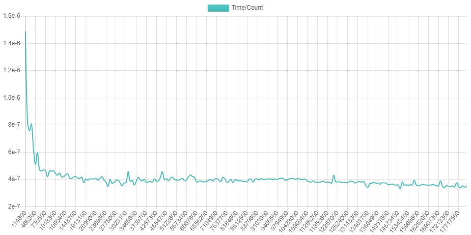
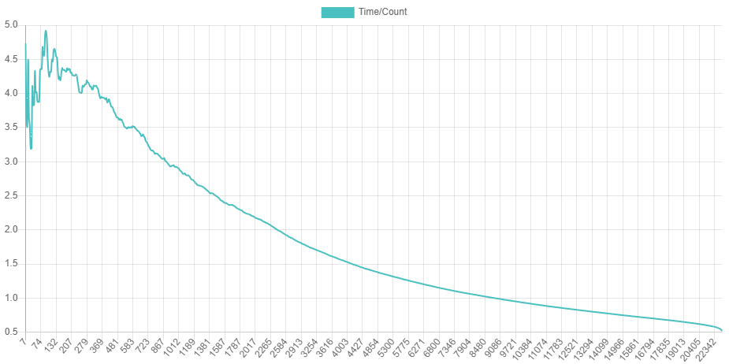
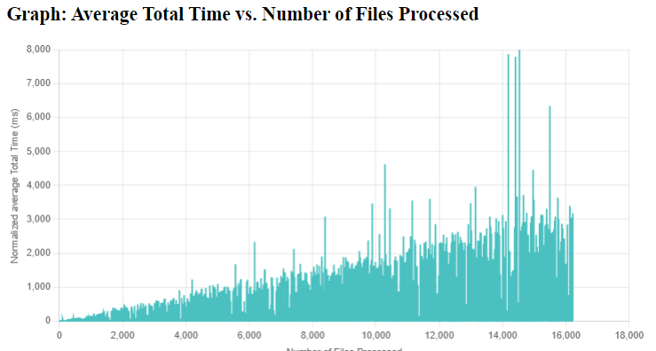

# Fork information:

Original code copied from: [https://github.com/mickesv/BigDataAnalytics]( https://github.com/mickesv/BigDataAnalytics). Edits made to code relevant to assignment.

## Assignment 3 Boot

To run the program, follow these instructions using the `boot.sh` script located in the `BigDataAnalysis` project folder. By default, running `boot.sh` with no flags will execute:

    docker-compose -f all-at-once-yaml up

### Available Flags

You can customize the behavior of the program by adding flags to the `boot.sh` script. Here are the available flags and their functionalities:

- `c`: Run the docker-compose down command to shut down active containers.

- `v`: Include the '-v' flag when using `docker-compose down` to remove volumes associated with containers.

- `i`: Include the '--rmi all' flag when using `docker-compose down`. Note that using this flag will require you to rebuild the `monitortool` and `clone-detector` images locally.

- `p`: Include 'p' to run `docker system prune` to clean up your local Docker instance.

- `b`: Include the '--build' option when running `docker-compose up` to rebuild the containers.

- `u`: Include the `-u` flag when building the `monitortool` container. This activates 'flush' mode and deactivates stdin/stdout buffering.

### Example Usage

As an example, to shut down active containers and volumes, prune your local Docker instance, and then rebuild the containers, you can run the following command:

    ./boot.sh cvpbu

This command will execute the necessary Docker operations with the specified flags.

## Assignment 3 Dicussion
### Final state
| Metric                               | Value              |
| ------------------------------------ | ------------------ |
| Completed after                      | 04:05:26:776       |
| Files Count                          | 163,589            |
| Chunks Count                         | 18,211,863         |
| Candidates Count                     | 584,748            |
| Clones Count                         | 24,961             |
| Average File Processing Time         | 0.0686 s           |
| Average Chunk Processing Time        | 2.6145 s           |
| Average Clone Expansion Time         | 0.4594 s           |
| Average Clone Size                   | 108.7991 lines     |
| Average number of chunks per file    | 159.8541 chunks    |

### Are you able to process the entire Qualitas Corpus? If not, what are the main issues (think in terms of data processing and storage) that causes the cljDetector to fail? How may you modify the application to avoid these issues?
I am able to process the entirety of the Qualitas Corpus, even on my low-performance laptop, which took 8 hours when not running it with my monitor tool service or other programs at the same time.

To save storage, some potential edits could be made to the clone identification step. For example, you could remove files as they are chunkified and chunks as they are turned into candidates, or when they are filtered out. Storing $18 \times 10^6$ chunks and 163 thousand files can be quite resource-intensive. Ultimately, the main purpose of the program is to identify clones, not to store all the files indefinitely.

Another option worth considering is utilizing a different type of database. While NoSQL databases like MongoDB are known for their horizontal scalability, it may not be necessary for your application, which is not distributed across multiple instances. Additionally, the flexibility of NoSQL might not be crucial since your database schema appears relatively rigid. In such cases, a vertically scalable database like SQL, such as PostgreSQL, could be a superior choice. The ability to use SQL joins and similar queries in relational databases can greatly simplify and optimize clone candidate identification compared to the options available in MongoDB. For instance, here's an example of the `identify-candidates` function from `storage.clj` implemented in SQL:

    SELECT chunkHash,
        COUNT(*) AS numberOfInstances,
        ARRAY_AGG(STRUCT(fileName, startLine, endLine)) AS instances
    FROM chunks
    GROUP BY chunkHash
    HAVING COUNT(*) > 1;

### Is the time to generate chunks constant or does it vary with the number of already generated chunks?

Due to issues with the plotting package I’m using for the website, I couldn’t get the axis labels to work properly, and I will therefore have to add them in-text. In the graph:
* x-axis: chunk count
* y-axis: average processing time

From what I can see in the charts, the file storing and chunk generation seem to be relatively constant. Ignoring the "high" initial time, which could be attributed to how I implemented my monitor function, the line appears to be nearly horizontal, with minor fluctuations.

### Is the time to generate clone candidates constant or does it vary with the number of already generated candidates?
Due to the code utilizing the aggregate function from the `mc` library for Clojure, the code doesn't actually add the clones to the database until it is completed. This means I don't have any means of measuring this from the original code without making large changes to it. However, if I investigate the [documentation](http://clojuremongodb.info/articles/aggregation.html) for the function, it doesn't seem to function in a way that it would be affected by the number of already identified candidates and works similarly to the `STRING_AGG` function in SQL.

### Is the time to expand clone candidates constant or does it vary with the number of already expanded clones or the number of remaining candidates?

In the graph:
* x-axis: clone count
* y-axis: average expansion time

As can be seen in the graph, the time it takes to expand the clones becomes lower as more clones are identified, moving towards zero (the fact that the last value is zero likely has to do with monitortool, not the data). I suspect this is because we remove candidates as they're expanded, leading to fewer candidates to look through for each iteation.

### What is the average clone size? How can this be used to predict progress during the expansion phase?
With `CHUNK_SIZE` set to 20, I got an average of 159.8541 chunks per file (calculated as num_chunks/num_files). While this doesn't directly affect the file reading step, having more chunks implies longer files, which will take more time to read. It also means that more chunks are created, potentially causing the line where the average reading and chunkification times fluctuate to be higher, but not necessarily fluctuating more.

In the "identify candidates" section, having more chunks per file means that each chunk will be smaller. This affects the likelihood of identifying clone candidates. For example, if we have a piece of code A:

    for i in range(5):
        print("Iteration:", i)
        print("Different line 1")
        print("Different line 2")
        print("Different line 3")
        print("Different line 4")

and another piece of code B:

    for i in range(5):
        print("Iteration:", i)
        print("Another different line 1")
        print("Another different line 2")
        print("Another different line 3")
        print("Another different line 4")

If we set a chunk size of two lines, this piece:

    for i in range(5):
        print("Iteration:", i)

Would become a clone candidate. However, if we instead have a chunk size of four lines, there would be no clone candidates in these pieces of code.

In short, the average number of chunks per file has the potential to describe both the average length of a file, affecting the time it takes to store all files, and how finely chunkified each file is, which can potentially affect how many clone candidates are identified.

## Assignment 3 Article summaries
### Article 1
Article 1 is *Software performance antipatterns* by Smith and Williams (2000). The authors discuss the concept of software design patterns and antipatterns, focusing on their impact on performance. They describe the difference between design patterns and antipatterns; established solutions to common software design problems vs. recurring design mistakes that lead to negative consequences.

The article introduces four performance-related antipatterns:
- **The God Class**
- **Excessive Dynamic Allocation**
- **Circuitous Treasure Hunt**
- **One Lane Bridge**

The article emphasizes the importance of considering performance consequences when using design patterns and antipatterns. It suggests that performance-related antipatterns help developers recognize and avoid common performance pitfalls, enhancing software architecture and design.

#### Measurements
The main measurements discussed in the article are related to the performance impact of the various software design antipatterns they discuss, evaluating the negative consequences of these antipatterns on software performance. The main measurements are:
- **Message Traffic**: The article discusses how the "God Class" antipattern can lead to excessive message traffic between classes, negatively affecting performance. It emphasizes the increase in the number of messages required to perform operations and its impact.
- **Dynamic Allocation Overhead**: In the "Excessive Dynamic Allocation" antipattern, the article measures the overhead caused by frequent creation and destruction of objects. It highlights the performance impact of dynamic allocation, especially in scenarios with high object turnover.
- **Database Access Patterns**: For the "Circuitous Treasure Hunt" antipattern, the article discusses the performance consequences of database access patterns. It measures the inefficiency of retrieving data in a way that requires a large number of database calls, particularly in distributed systems.
- **Service Time**: The article quantifies the impact of reducing service time, particularly in the context of the "One Lane Bridge" antipattern. It discusses how minimizing the time required for specific operations can improve overall responsiveness.

#### Main findings
The main findings of the article are that design patterns and antipatterns are valuable tools in software development for capturing expert knowledge and best practices, as well as identifying common design mistakes and their solutions. The authors highlight the need for both design patterns and antipatterns that explicitly address performance issues, as well as the importance of building performance intuition among software developers.

Overall, the article underscores the significance of integrating performance considerations into the design and development process, alongside the use of design patterns and antipatterns, to create more efficient and responsive software systems.

### Article 2
Article 2 is *New software performance antipatterns: More ways to shoot yourself in the foot* by Smith and Williams (2002). The article is a continuation of Article 1 and introduces four new performance antipatterns:
- **Unbalanced Processing**
- **Unnecessary Processing**
- **The Ramp**
- **More is Less**

The article emphasizes the importance of identifying these antipatterns early in the software development process, using models or measurements to assess their impact, and providing solutions that adhere to performance principles. Performance antipatterns help build developers' performance intuition and complement traditional design and architectural patterns.

#### Measurements
Article 2 does not contain specific measurements or quantitative data. Instead, it provides a conceptual understanding of the antipatterns and emphasizes the importance of identifying and addressing them in software development.

#### Main findings
Like Article 1, the article emphasizes the importance of identifying antipatterns early in the software development process to avoid scalability and performance problems. It also highlights the role of models and measurements in identifying and mitigating these issues.

### Article 3
Article 3 is *More new software performance antipatterns: Even more ways to shoot yourself in the foot* by Smith and Williams (2003). The article aims to expand the documentation of software antipatterns that started in Article 1 and continued in Article 2. The article introduces three additional antipatterns:
- **Falling Dominoes**
- **Tower of Babel**
- **Empty Semi Trucks**

#### Measurements
Like Article 2, Article 3 does not contain any quantitative measurements.

#### Main findings
Like Articles 1 and 2, Article 3 emphasizes the importance of identifying antipatterns early in the software development process to avoid scalability and performance problems. It also highlights the role of models and measurements in identifying and mitigating these issues. At the end, the authors list the currently documented antipatterns (14 in total).

### What can you learn?
Since my answer to all three "What can you learn?" questions will be marginally different, I'll just summarize it in one.

Due to me having done the Software Architecture course I already knew some of what was discussed in the articles. However, it was interesting to see quantitative data on the effects of some of the antipatterns, and I had not heard of a few of them, or at least not the names used, such as the *Circuitous Treasure Hunt* or *Empty Semi Trucks* patterns.

## Assignment 2 Questions:
#### Are you able to process the entire Qualitas Corpus? If not, what are the main issues (think in terms of data processing and storage) that causes the CodeStreamConsumer to hang? How can you modify the application to avoid these issues?

It would be difficult to process the entirety of the Qualitas Corpus, at least on my home PC. In fact, the program seems to stop processing around 23900 files read, likely due to the sheer size of the data needing to be processed more or less at the same time towards the end. I would say it's *theoretically* possible to do it, however not with the average PC's capabilities...

The way that the `CloneDetector` seems to be doing it right now is to compare line-to-line (or, to be more exact, chunk-by-chunk) in two files. This method brings upon it three main issue points:

1. **Performance Issues**: CloneDetector, or more specifically the CodeStreamConsumer component, suffers from performance problems. It hangs during processing, even when dealing with relatively small datasets. This issue can significantly impact its usability for handling actual Big Data workloads.
2. **Memory Consumption**: CodeStreamConsumer uses a `FileStorage` class, which keeps all processed files in memory. Additionally, it maintains a "chunkified" version of each file in memory as well. This approach effectively doubles the memory footprint for each file, which can lead to high memory usage and potential memory-related problems.
3. **Suboptimal Resource Utilization**: In many cases, the original file is not needed once the initial processing is completed.

The main points of utilization I can see are related to the latter two. These can be improved in various ways, including:

- **Hashing**: Instead of comparing SourceLines directly, calculate hash values (e.g., checksums or cryptographic hashes) for each SourceLine. Then, compare the hash values first, and only if they match, perform a detailed line-by-line comparison. Hashing can significantly reduce the number of full text comparisons.
- **Tokenization**: In a way similar to hashing, one can tokenize the SourceLines into smaller units, such as words or symbols, using a lexer or tokenizer. Then, compare the tokenized representations of the lines. Tokenization can help identify partial similarities without comparing entire lines.
- **Caching**: One can implement caching mechanisms to store previously compared chunks or lines. If the same chunks appear in different files, reuse the comparison results to avoid redundant work. To more efficiently one can implement an algorithm that sorts out the most commonly found clone elements, although it might not be too applicable to this program since it might be that every clone is unique.

#### Comparing two chunks implies \code{CHUNKSIZE} comparisons of individual \code{SourceLines}. What can be done to reduce the number of comparisons?

A way I can consider is to implement hashing of the `SourceLines` to make them easier to compare and store, and then implement a has table with the strucutre `<hash, file>`. You need then only to look what hashes has more than one file source and investigate those.

#### Studying the time it takes to process each file, do you see any trends as the number of already processed files grow? What may be the reasons for these trends (think in terms of the data processing algorithms)?

Other than what has already been mentioned in earlier questions, one can observe the graph over the average total procerssing time/number of files, as presented in the graph:

One can see that the more files processed, the longer the average time becomes, This is natural considering the bubblesort-like way the algorithm is tackling the problem. Since every file is compared to every file before it, it will mean that for every file you have checked, there is another file to a check, for every ten, there are ten more. The increase is (almost) linear, if you ignore the outliers, that are likely due to the algorithm, having to look through more/less files before finding anything. There are also no early stop conditions for the algorithm as we want to look through all the code files to find any clones. This is another aspect that makes it like bubble sort. 

# Big Data Analytics
Work material for parts of a course "Applied Computing and Big Data" offered by Blekinge Institute of Technology.

We are using the [Qualitas Corpus](http://qualitascorpus.com/) as a starting point for some fun very-nearly-big-data analysis.

Documentation and step-by-step instructions for this part of the course is found in the [Documentation](Documentation) directory.

## About the Course
The course Applied Cloud Computing and Big Data is a 7.5 ECTS course offered by Blekinge Institute of Technology. The course is organised around three themes, and all three themes must be completed to complete the course:

- Cloud Provisioning and Deployment
- The Business Case for Cloud Computing
- Big Data Analytics

The course is divided across two source code repositories:

- https://github.com/mickesv/ProvisioningDeployment.git contains the instructions and source code for the Cloud Provisioning and Deployment, and the Business Case for Cloud Computing parts of the course.
- https://github.com/mickesv/BigDataAnalytics.git contains the instructions and source code for the Big Data Analytics part of the course.

## Apply
If you wish to apply for the course, please visit [UniversityAdmissions](https://www.universityadmissions.se/intl/start) and search for "Applied Cloud Computing and Big Data".
