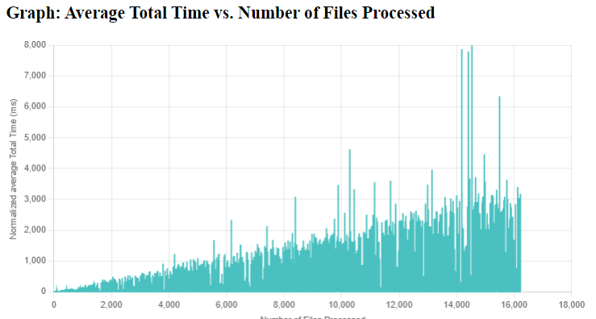

# Fork information:

Original code copied from: [ https://github.com/mickesv/BigDataAnalytics]( https://github.com/mickesv/BigDataAnalytics). Edits made to code relevant to assignment.

## Assignment 3 Boot

To run the program, follow these instructions using the `boot.sh` script located in the `BigDataAnalysis` project folder. By default, running `boot.sh` with no flags will execute:

    docker-compose -f all-at-once-yaml up

### Available Flags

You can customize the behavior of the program by adding flags to the `boot.sh` script. Here are the available flags and their functionalities:

- `c`: Run the docker-compose down command to shut down active containers.

- `v`: Include the '-v' flag when using `docker-compose down` to remove volumes associated with containers.

- `i`: Include the '--rmi all' flag when using `docker-compose down`. Note that using this flag will require you to rebuild the `monitortool` and `clone-detector` images locally.

- `p`: Include 'p' to run `docker system prune` to clean up your local Docker instance.

- `b`: Include the '--build' option when running `docker-compose up` to rebuild the containers.

- `u`: Include the `-u` flag when building the `monitortool` container. This activates 'flush' mode and deactivates stdin/stdout buffering.

### Example Usage

As an example, to shut down active containers and volumes, prune your local Docker instance, and then rebuild the containers, you can run the following command:

    ./boot.sh cvpbu

This command will execute the necessary Docker operations with the specified flags.

## Assignment 2 Questions:
#### Are you able to process the entire Qualitas Corpus? If not, what are the main issues (think in terms of data processing and storage) that causes the CodeStreamConsumer to hang? How can you modify the application to avoid these issues?

It would be difficult to process the entirety of the Qualitas Corpus, at least on my home PC. In fact, the program seems to stop processing around 23900 files read, likely due to the sheer size of the data needing to be processed more or less at the same time towards the end. I would say it's *theoretically* possible to do it, however not with the average PC's capabilities...

The way that the `CloneDetector` seems to be doing it right now is to compare line-to-line (or, to be more exact, chunk-by-chunk) in two files. This method brings upon it three main issue points:

1. **Performance Issues**: CloneDetector, or more specifically the CodeStreamConsumer component, suffers from performance problems. It hangs during processing, even when dealing with relatively small datasets. This issue can significantly impact its usability for handling actual Big Data workloads.
2. **Memory Consumption**: CodeStreamConsumer uses a `FileStorage` class, which keeps all processed files in memory. Additionally, it maintains a "chunkified" version of each file in memory as well. This approach effectively doubles the memory footprint for each file, which can lead to high memory usage and potential memory-related problems.
3. **Suboptimal Resource Utilization**: In many cases, the original file is not needed once the initial processing is completed.

The main points of utilization I can see are related to the latter two. These can be improved in various ways, including:

- **Hashing**: Instead of comparing SourceLines directly, calculate hash values (e.g., checksums or cryptographic hashes) for each SourceLine. Then, compare the hash values first, and only if they match, perform a detailed line-by-line comparison. Hashing can significantly reduce the number of full text comparisons.
- **Tokenization**: In a way similar to hashing, one can tokenize the SourceLines into smaller units, such as words or symbols, using a lexer or tokenizer. Then, compare the tokenized representations of the lines. Tokenization can help identify partial similarities without comparing entire lines.
- **Caching**: One can implement caching mechanisms to store previously compared chunks or lines. If the same chunks appear in different files, reuse the comparison results to avoid redundant work. To more efficiently one can implement an algorithm that sorts out the most commonly found clone elements, although it might not be too applicable to this program since it might be that every clone is unique.

#### Comparing two chunks implies \code{CHUNKSIZE} comparisons of individual \code{SourceLines}. What can be done to reduce the number of comparisons?

A way I can consider is to implement hashing of the `SourceLines` to make them easier to compare and store, and then implement a has table with the strucutre `<hash, file>`. You need then only to look what hashes has more than one file source and investigate those.

#### Studying the time it takes to process each file, do you see any trends as the number of already processed files grow? What may be the reasons for these trends (think in terms of the data processing algorithms)?

Other than what has already been mentioned in earlier questions, one can observe the graph over the average total procerssing time/number of files, as presented in the graph:

One can see that the more files processed, the longer the average time becomes, This is natural considering the bubblesort-like way the algorithm is tackling the problem. Since every file is compared to every file before it, it will mean that for every file you have checked, there is another file to a check, for every ten, there are ten more. The increase is (almost) linear, if you ignore the outliers, that are likely due to the algorithm, having to look through more/less files before finding anything. There are also no early stop conditions for the algorithm as we want to look through all the code files to find any clones. This is another aspect that makes it like bubble sort. 

# Big Data Analytics
Work material for parts of a course "Applied Computing and Big Data" offered by Blekinge Institute of Technology.

We are using the [Qualitas Corpus](http://qualitascorpus.com/) as a starting point for some fun very-nearly-big-data analysis.

Documentation and step-by-step instructions for this part of the course is found in the [Documentation](Documentation) directory.

## About the Course
The course Applied Cloud Computing and Big Data is a 7.5 ECTS course offered by Blekinge Institute of Technology. The course is organised around three themes, and all three themes must be completed to complete the course:

- Cloud Provisioning and Deployment
- The Business Case for Cloud Computing
- Big Data Analytics

The course is divided across two source code repositories:

- https://github.com/mickesv/ProvisioningDeployment.git contains the instructions and source code for the Cloud Provisioning and Deployment, and the Business Case for Cloud Computing parts of the course.
- https://github.com/mickesv/BigDataAnalytics.git contains the instructions and source code for the Big Data Analytics part of the course.

## Apply
If you wish to apply for the course, please visit [UniversityAdmissions](https://www.universityadmissions.se/intl/start) and search for "Applied Cloud Computing and Big Data".
